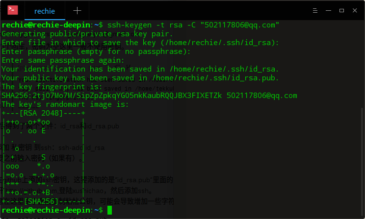
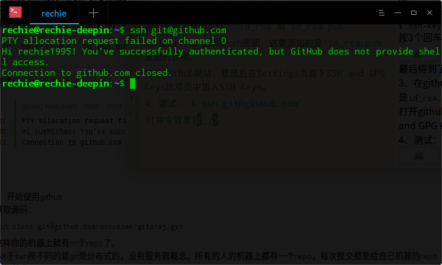

# github-ssh key创建
## 生成ssh密钥过程
1、查看是否已经有了ssh密钥：`$ cd ~/ssh`  
如果没有密钥则不会有此文件夹，有则备份删除。  
2、生成密钥：  
`$ ssh-keygen -t rsa -C "502117806@qq.com"`  
按3个回车，密码为空这里一般不使用密钥。
  
最后得到了两个文件：`id_rsa`和`id_rsa.pub`  
3、在github上添加ssh密钥，这要添加的是`id_rsa.pub`里面的公钥。  
打开github网站，登陆后在Settings页面下SSH and GPG Keys选项页中加入SSH Keys。  
4、测试：`$ ssh git@github.com`  
  
如图所示，就算成功了。了。